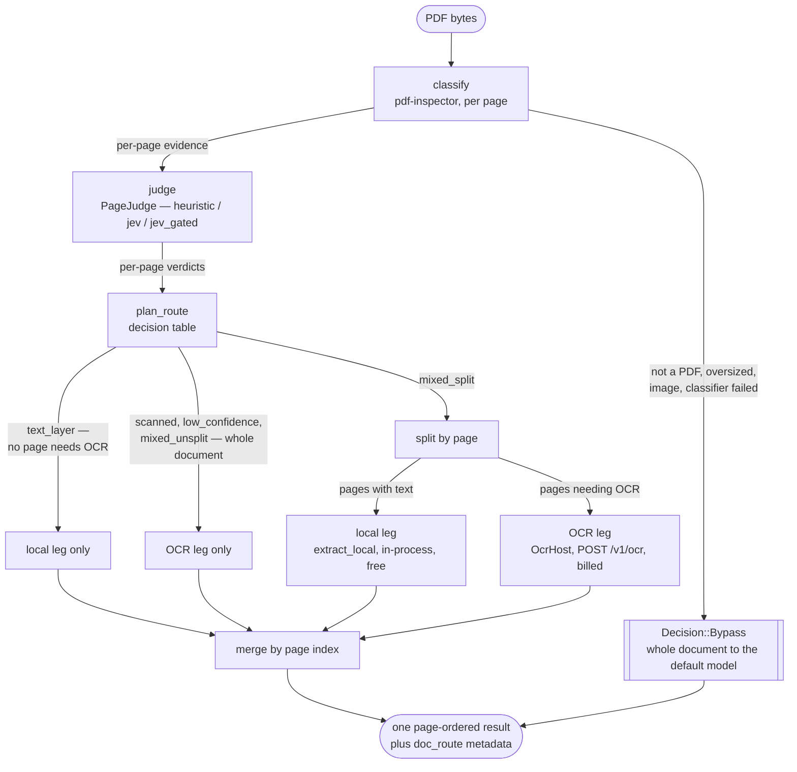

# doc-router — full reference

**Don't pay to OCR a page that already has text on it.**

This is the complete manual: every flag, every env var, every judge, the report format,
the architecture and the troubleshooting list. For the two-minute version, see the
[README](../README.md).

Most PDFs in the wild are not all-scan or all-text: a contract with two signature scans
in the middle, a report whose appendix was photocopied, an invoice batch where every
third document came off a flatbed. Sending the whole file to a hosted OCR model means
paying for every page, including the ones you could have read for free.

`doc-router` looks at a PDF **page by page**, decides which pages have a usable text
layer and which genuinely need OCR, then executes that decision: the text pages are
extracted locally, in-process, with no network call; only the pages that need OCR are
sent to your OCR provider; the two halves are merged back into one page-ordered result.
You pay for a subset of the pages instead of the whole document.

Nothing in the core library touches a network. Calling an OCR provider is your job,
behind a small `OcrHost` trait — the shipped CLI is the worked example of one.

It is a port of LiteLLM's Python document router
(`litellm/router_strategy/doc_router/`), with the same classification, the same decision
table and the same metadata keys, so a document routed by either implementation lands on
the same model.

### How much does it actually save?

Measured on 2026-09-17 against the corpus in `tests/corpus/` — **19 documents, 155 pages,
87 of which genuinely need OCR** — using `mistral-ocr-latest` through a live LiteLLM
gateway, 3 runs per document. Reproduce it with the command in [Benchmarking](#benchmarking).

| | OCR every page | routed (`--judge jev`) | |
|---|---|---|---|
| pages sent to OCR | 155 | 87 | |
| OCR API requests | 19 | 13 | |
| OCR wall clock | 35,578 ms | 20,666 ms | **1.72x faster** |
| end to end, classifier included | 35,578 ms | 23,680 ms | **1.50x faster** |
| bill at $2.00/1k pages | $0.3100 | $0.1740 + $0.0043 judge | **1.74x cheaper** |
| pages that needed OCR and didn't get it | 0 | 9 (vs **28** for the built-in heuristic) | |

Three things worth reading twice:

- **The judge costs 2.5% of the OCR bill it authorises** — 18 calls, 102,457 input tokens,
  $0.0043 at Jev's $0.042/M input, output free.
- **The classifier is not what got faster.** Jev adds ~156 ms per document over the local
  heuristic. Every speedup above comes from routing fewer pages to OCR.
- **A cheaper bill is not automatically a better result.** The built-in heuristic bills
  $0.1360 — cheaper than Jev — by skipping 28 pages that needed OCR. `doc-router-bench`
  prints the *ceiling* (the most any correct router could save) precisely so a judge that
  "saves" more than the ceiling is named as broken rather than frugal.

Jev is a model, so it is not identical run to run: an earlier run of this corpus missed 11
pages rather than 9, i.e. 2.5x-3.1x fewer misses than the heuristic. The 155-vs-87
comparison is fully measured on both arms; rows for other page counts scale the measured
237.5 ms/page linearly, which flatters them slightly, because per-request overhead is real
and not linear.

Numbers from someone else's corpus are a sales pitch. Run the harness against **your**
documents — it reports overspend and underspend separately, and prices the judge from the
tokens the judge itself reported.

---

## Contents

- [Requirements and build](#requirements-and-build)
- [Quickstart](#quickstart) — three tiers: [no keys](#tier-1--no-keys-at-all),
  [with an OCR provider](#tier-2--with-an-ocr-provider),
  [with Jev](#tier-3--with-jev-a-smarter-judge)
- [**Run it on your own PDFs**](#run-it-on-your-own-pdfs)
- [Configuration reference](#configuration-reference)
- [Choosing an OCR backend](#choosing-an-ocr-backend)
- [Judges](#judges)
- [Benchmarking](#benchmarking)
- [Architecture](#architecture)
- [CLI reference](#cli-reference)
- [Using it as a library](#using-it-as-a-library)
- [Python bindings](#python-bindings)
- [Development](#development)
- [Troubleshooting](#troubleshooting)
- [Layout](#layout)

---

## Requirements and build

* **Rust 1.88 or newer** (`rust-version = "1.88"` in the workspace `Cargo.toml`,
  edition 2021). No nightly, no system libraries, no other tooling.
* Optional, only for the Python bindings: Python 3.10+ and
  [maturin](https://www.maturin.rs/).

```sh
git clone <this repo> doc-router
cd doc-router
cargo build --workspace --release
```

Two binaries land in `target/release/`:

| binary | what it is |
|--------|------------|
| `target/release/doc-router` | the CLI: `classify`, `plan`, `extract`, `split`, `run` |
| `target/release/doc-router-bench` | the benchmark harness (not published to crates.io) |

To put the CLI on your `$PATH`:

```sh
cargo install --path crates/doc-router-cli   # installs the `doc-router` binary
```

The rest of this README writes `doc-router` for the CLI; if you did not install it, use
`./target/release/doc-router` from the repo root instead.

---

## Quickstart

Three tiers. Tier 1 needs nothing but the repo, and is worth running first: it exercises
the whole decision path without asking you to sign up for anything.

### Tier 1 — no keys at all

Classification, planning, local extraction and splitting are entirely offline. Run these
from the repo root against a fixture that ships with it:

```sh
doc-router classify tests/fixtures/mixed.pdf
```

```console
tests/fixtures/mixed.pdf: mixed (confidence 0.70), 4 page(s), 2 needing OCR [1,3], simple layout, classified in 4.0 ms
```

Four pages; pages 1 and 3 (**0-indexed**) have no usable text layer. Add `--json` for the
machine-readable form — this is the crate's own serde output, with the same field names
the Python router uses, plus a `judge` object the CLI adds to say which judge produced the
verdicts (see [`--judge`](#--judge)):

```sh
doc-router --json classify tests/fixtures/mixed.pdf
```

```console
{
  "pdf_type": "mixed",
  "confidence": 0.7,
  "page_count": 4,
  "pages_needing_ocr": [
    1,
    3
  ],
  "is_complex_layout": false,
  "has_encoding_issues": false,
  "ocr_reasons": [
    {
      "page": 1,
      "reasons": [
        "scanned"
      ]
    },
    {
      "page": 3,
      "reasons": [
        "scanned"
      ]
    }
  ],
  "classify_ms": 1.097458,
  "judge": {
    "name": "heuristic"
  }
}
```

Now ask what it *would* do. `plan` runs the decision table and prints the `doc_route`
metadata a proxy would log. Still no network:

```sh
doc-router plan tests/fixtures/mixed.pdf
```

```console
tests/fixtures/mixed.pdf: route mixed_split -> mistral-ocr (tier standard)
  mixed (confidence 0.70), 4 page(s), 2 needing OCR [1,3], simple layout, classified in 1.1 ms
  leg local_pdf/extract        local     pages [0,2]
  leg mistral-ocr              standard  pages [1,3]
```

Two legs: pages 0 and 2 read locally, pages 1 and 3 to OCR. That is the whole idea —
**half this document never reaches a paid model.**

Read the local half for free:

```sh
doc-router extract tests/fixtures/mixed.pdf --pages 0,2 --out ./pages
```

```console
wrote 2 page file(s) to ./pages
```

```sh
ls pages
```

```console
page-0.md
page-2.md
```

And build the subset PDF you would hand to an OCR provider that cannot take a page list:

```sh
doc-router split tests/fixtures/mixed.pdf --pages 1,3 --out ocr-pages.pdf
```

```console
wrote 2 page(s) [1,3] to ocr-pages.pdf (1043 bytes)
```

Sanity-check it — the subset is now all-scan, as expected:

```sh
doc-router classify ocr-pages.pdf
```

```console
ocr-pages.pdf: scanned (confidence 0.95), 2 page(s), 2 needing OCR [0,1], simple layout, classified in 0.5 ms
```

That is the entire router, minus the paid call.

### Tier 2 — with an OCR provider

`doc-router run` does the whole thing: classify, plan, run the local leg in-process, POST
the OCR leg to `<base-url>/v1/ocr`, merge. You need a **LiteLLM proxy** (hosted or local
— see [Choosing an OCR backend](#choosing-an-ocr-backend)) and a key.

```sh
export LITELLM_API_KEY=sk-...

doc-router run tests/fixtures/mixed.pdf \
  --base-url https://litellm.example.com \
  --default-model gpt-4o-mini \
  --out result.json
```

`--base-url` is **required and has no default**; `/v1/ocr` is appended to it. The model
ids come from the config (`--config`; without one you get `local_pdf/extract` +
`mistral-ocr`), so point `tiers.standard` at whatever your gateway registers:

```sh
cat > config.json <<'JSON'
{
  "tiers": {
    "local": "local_pdf/extract",
    "standard": "mistral/mistral-ocr-latest"
  }
}
JSON

doc-router --config config.json plan tests/fixtures/mixed.pdf
```

```console
tests/fixtures/mixed.pdf: route mixed_split -> mistral/mistral-ocr-latest (tier standard)
  mixed (confidence 0.70), 4 page(s), 2 needing OCR [1,3], simple layout, classified in 7.0 ms
  leg local_pdf/extract        local     pages [0,2]
  leg mistral/mistral-ocr-latest standard  pages [1,3]
```

> Every command in this README was run, and the output under it is real. The one
> exception is a **successful** `doc-router run` against a live gateway: that bills, so
> no success output for it is pasted anywhere in this file. Its *failure* paths were
> exercised and appear under [Troubleshooting](#troubleshooting).

### Tier 3 — with Jev, a smarter judge

The default judge is structural: it trusts pdf-inspector's answer about whether a page
carries text operators. That is right almost always, and wrong in exactly the cases that
cost you most — a scan carrying a bad pre-existing OCR layer, a page whose only text is a
watermark, a CID font with a broken `ToUnicode` map. Structurally those pages look fine;
the text is there, it just doesn't mean anything. (The adversarial half of this repo's
own corpus is made of those cases, and the heuristic does measurably worse on it — see
[Benchmarking](#benchmarking).)

`doc-router-jev` sends the extracted text to TypeSafe's hosted "System One" model and
asks whether it is actually readable. Set one key and the benchmark harness picks it up:

```sh
export TYPESAFE_API_KEY=...          # or JEV_API_KEY
cargo run -q -p doc-router-bench -- --judge heuristic --judge jev
```

With no key set, the harness says so and carries on with the baseline rather than
failing — verified:

```console
skipped judge `jev`: no API key in the environment: set TYPESAFE_API_KEY (or JEV_API_KEY), or put it in a .env file at the workspace root
```

The same key makes Jev selectable from the CLI: `classify`, `plan` and `run` take
`--judge <NAME>`. Without the flag they use the heuristic, exactly as before. Unlike the
harness, the CLI does **not** carry on with the baseline when the judge you named cannot
be built — asking for a judge and silently getting a different one is the failure this
flag exists to remove — verified:

```console
$ doc-router classify --judge jev tests/fixtures/mixed.pdf
Error: judge `jev` is unavailable: no API key in the environment: set TYPESAFE_API_KEY (or JEV_API_KEY)
```

See [CLI reference](#cli-reference) for the flag and [Judges](#judges) for the names.
From Rust it is `doc_router::classify_with(&bytes, &judge)`.

---

## Run it on your own PDFs

This is the part that matters. Everything above used a fixture; none of it is specific to
this repo's files.

### One document, right now

```sh
doc-router classify /path/to/your.pdf      # what kind of PDF is it?
doc-router plan     /path/to/your.pdf      # which pages would cost money?
doc-router extract  /path/to/your.pdf      # the text layer it can already read, free
```

Reading `plan`'s output:

* `route <reason> -> <model> (tier <tier>)` — the decision, and where the OCR leg would
  go. `<reason>` is one of `low_confidence`, `text_layer`, `scanned`, `mixed_unsplit`,
  `mixed_split` (see the [decision table](#decision-table)).
* `N page(s), M needing OCR [...]` — **the list is 0-indexed.** `M` is what you would be
  billed for; `N - M` is what you get for free.
* `leg <model> <tier> pages [...]` — one line per leg. A `local` leg runs in-process. Any
  other leg is one HTTP request.
* `bypass <reason> -> <model>` instead of `route` means the input was not routable at all
  (not a PDF, oversized, an image, or the classifier failed). A bypass is a normal
  outcome, not an error: the command still exits 0 and the whole document goes to the
  default model.

### A directory of your own documents, scored

The benchmark harness takes a **manifest** — a JSON file listing your documents and the
truth about them — and tells you, per judge, how many pages were missed (needed OCR,
didn't get it) and how many were wasted (didn't need OCR, got it anyway).

The manifest can live anywhere; paths inside it are resolved **relative to the manifest's
own directory**, so it does not have to be inside this repo:

```sh
mkdir -p ~/my-corpus
cp /path/to/your/*.pdf ~/my-corpus/
```

Write `~/my-corpus/manifest.json`:

```json
{
  "documents": [
    {
      "file": "mixed.pdf",
      "source": "my-scans",
      "page_count": 4,
      "needs_ocr": [1, 3],
      "note": "two scanned pages in the middle"
    }
  ]
}
```

| field | required | meaning |
|-------|----------|---------|
| `file` | yes | path to the PDF, relative to the manifest's directory (absolute paths are used as-is) |
| `source` | yes | free-text group label; the report aggregates by it. `"synthetic"` is treated specially in the report's caveat section |
| `page_count` | yes | how many pages the document really has. **Checked against the classifier** |
| `needs_ocr` | yes | **0-indexed** page numbers that genuinely need OCR. `[]` for an all-text document |
| `note` | no | free text, for you |

Two rules worth knowing before you write one:

1. **`needs_ocr` is 0-indexed.** The first page is `0`. This matches every other page
   number in the project, including what `doc-router classify` prints. A page number
   `>= page_count`, or a repeated one, is rejected when the manifest loads.
2. **`page_count` must match what the classifier finds.** If it doesn't, the document is
   *excluded from the score* and the whole run exits non-zero — deliberately, not as a
   warning, because an off-by-one `page_count` means your `needs_ocr` list describes a
   different document and any score computed from it would be a plausible-looking lie.
   Verified:

   ```console
   EXCLUDED DOCUMENTS (1)
     These could not be scored at all. They are harness failures, not judge scores, and the
     exit code is non-zero because of them. A judge scoring badly is a result, not a
     failure, and never lands here.
     - mixed.pdf
         judge: heuristic
         page_count mismatch: the manifest declares 5 page(s), the classifier reports 4.
         The manifest's 0-indexed needs_ocr list ([1, 3]) therefore describes a different
         document; excluded from the score rather than scored against the wrong pages
   ```

   If you don't know a document's page count, ask: `doc-router classify yourfile.pdf`.

Unknown fields are rejected, so a typo surfaces immediately rather than silently scoring
every judge against wrong truth — verified:

```console
error: could not parse corpus manifest /path/to/bad.json: unknown field `pages`, expected one of `file`, `source`, `page_count`, `needs_ocr`, `note` at line 1 column 94
```

Then run it:

```sh
cargo run -q -p doc-router-bench -- --corpus ~/my-corpus/manifest.json
```

```console
doc-router bench
corpus   /Users/you/my-corpus/manifest.json
scored   1 of 1 document(s)
repeat   3 run(s) per document; every latency below is that document's median
cost     1.0000 per OCR page -- abstract cost units unless you passed a price of your
         own via --cost-per-page; no vendor's price is baked in
judges   heuristic (baseline)

================ judge: heuristic (baseline) ================

ERRORS (raw counts; the two kinds are never added together)
  missed OCR       0   page needed OCR and did not get it
                       -> silent quality failure: the document routes as text and the
                          text is not there
  wasted OCR       0   page did not need OCR and got it
                       -> costs money and latency; the output is still correct
  pages            4   2 truly need OCR, 2 truly do not
  documents        1   1 routed exactly (every page on the correct side)

PER DOCUMENT
  document   pages  pdf_type      missed  wasted  route         ms
  mixed.pdf      4  mixed              0       0  exact      7.928

BY SOURCE
  source    docs  pages  missed  wasted  route exact
  my-scans     1      4       0       0          1/1
```

(Real output from a one-document manifest built exactly as described above; the sections
below it are shown under [Reading the report](#reading-the-report).)

To price it in money rather than pages, pass your provider's per-page rate:

```sh
cargo run -q -p doc-router-bench -- --corpus ~/my-corpus/manifest.json --cost-per-page 0.001
```

The repo's own corpus lives in `tests/corpus/` and grows over time; its schema is the one
documented here, and `tests/corpus/README.md` is its reference.

---

## Configuration reference

### Environment variables

Every variable the workspace reads. **None is required for Tier 1.**

| variable | read by | purpose | default | required |
|----------|---------|---------|---------|----------|
| `LITELLM_API_KEY` | `doc-router run`, `examples/litellm_adapter.py` | bearer token for the OCR gateway; sent as `Authorization: Bearer …`, and the header is omitted entirely when unset | — | only for `run` against a gateway that authenticates |
| `LITELLM_PROXY_API_KEY` | same | second name checked, **after** `LITELLM_API_KEY` | — | no |
| `LITELLM_BASE_URL` | `examples/litellm_adapter.py` only | gateway origin, without the `/v1/ocr` path. The Rust CLI takes `--base-url` instead and has **no** env fallback for it | — | only for the Python example |
| `TYPESAFE_API_KEY` | `doc-router-jev` (`JevJudge::from_env`) | API key for TypeSafe System One. Setting it is the only thing that enables the `jev` / `jev_gated` judges | — | only for the Jev judges |
| `JEV_API_KEY` | same | second name checked, **after** `TYPESAFE_API_KEY` | — | no |
| `TYPESAFE_BASE_URL` | same | override the Jev API origin. The endpoint path `/v1/systemone` is appended and is not configurable | `https://api.typesafe.ai` | no |
| `TYPESAFE_MODEL` | same | override the Jev model id | `jev-latest` | no |

A blank or whitespace-only value counts as unset, for both key pairs. `--api-key` on the
CLI beats both `LITELLM_*` variables; the variables are only a fallback.

### The `.env` file

There is an optional `.env` at the **workspace root**. `.env.example` in this repo lists
every variable above with placeholder values; copy it:

```sh
cp .env.example .env
$EDITOR .env
```

What you need to know about it:

* **It is gitignored** (`.gitignore` line 3 is `.env`). `.env.example` is not, so never
  put a real key in `.env.example`.
* **Only `doc-router-bench` reads it.** The CLI and the Python bindings read the real
  process environment only. This is deliberate: the bench is a developer tool run from
  inside the checkout; the CLI is a binary that could be run from anywhere.
* **The real environment always wins.** A variable already exported in your shell is
  never overwritten by a line in `.env`.
* A missing file is not an error; a malformed line is skipped, not fatal.
* `export KEY=value` is accepted, one matching pair of surrounding quotes is stripped,
  and everything after the first `=` is the value (so `=` inside a value survives).
* At startup the harness prints only the **names** it loaded, never the values:
  `loaded TYPESAFE_API_KEY from .env`.
* Nothing in this workspace ever writes to `.env`.

### The config file (`--config`)

The file is the `doc_router_config` block verbatim — the same JSON LiteLLM accepts.
Unknown keys are rejected. Only `tiers.local` and `tiers.standard` are required:

```json
{
  "tiers": {
    "local": "local_pdf/extract",
    "standard": "mistral-ocr",
    "premium": "gpt-4o"
  },
  "min_confidence": 0.6,
  "complex_layout_tier": "premium",
  "max_document_bytes": 52428800,
  "fetch_timeout_seconds": 20.0,
  "split_pages": true
}
```

| key | default | meaning |
|-----|---------|---------|
| `tiers.local` | — (required) | the in-process extractor. Use `local_pdf/extract`; it is a label, not a model |
| `tiers.standard` | — (required) | the OCR model id sent to your gateway |
| `tiers.premium` | unset | optional second OCR model for complex layouts |
| `min_confidence` | `0.6` | below this the classifier is not trusted and the whole document goes to OCR (`low_confidence`) |
| `complex_layout_tier` | `premium` | which OCR tier a tables/columns document gets. Automatically downgraded to `standard` when no premium model is configured |
| `max_document_bytes` | `52428800` (50 MiB) | larger inputs bypass to the default model |
| `fetch_timeout_seconds` | `20.0` | timeout for fetching a document by URL |
| `split_pages` | `true` | `false` sends a mixed document whole to OCR instead of splitting it (`mixed_unsplit`) |

Without `--config` the CLI uses `local_pdf/extract` + `mistral-ocr` with every other knob
at its default.

---

## Choosing an OCR backend

`doc-router` does not implement OCR. It needs something that answers
`POST <base>/v1/ocr`. There are three genuinely supported ways to get one.

### (a) A LiteLLM proxy you already run

If your organisation already has a LiteLLM gateway with an OCR model registered, you are
done: point `--base-url` at it and set `tiers.standard` to the model id the gateway
registers.

The Rust host (`LiteLlmHost`, in `crates/doc-router-cli/src/host.rs`) **posts the model id
verbatim** to `/v1/ocr`. Whatever string your gateway's `model_name` is, put exactly that
in `tiers.standard`. No prefix rewriting happens on the Rust side.

*Trade-off:* zero setup, but you inherit the gateway's model list, its rate limits and its
key policy, plus a network hop you don't control.

### (b) A local LiteLLM gateway

Run one yourself. Two routes, both from LiteLLM's own documentation.

**Docker** — from <https://docs.litellm.ai/docs/proxy/docker_quick_start>:

```sh
docker run \
  -v $(pwd)/litellm_config.yaml:/app/config.yaml \
  -e MISTRAL_API_KEY=<your-mistral-key> \
  -e LITELLM_MASTER_KEY=sk-<paste-a-long-random-key> \
  -p 4000:4000 \
  docker.litellm.ai/berriai/litellm:latest \
  --config /app/config.yaml
```

**Local install** — <https://docs.litellm.ai/docs/proxy/quick_start> shows
`uv tool install 'litellm[proxy]'`:

```sh
uv tool install 'litellm[proxy]'
litellm --config litellm_config.yaml
# RUNNING on http://0.0.0.0:4000
```

The OCR model registration, from <https://docs.litellm.ai/docs/ocr>:

```yaml
model_list:
  - model_name: mistral-ocr
    litellm_params:
      model: mistral/mistral-ocr-latest
      api_key: os.environ/MISTRAL_API_KEY
```

Then:

```sh
export LITELLM_API_KEY=sk-<the LITELLM_MASTER_KEY you chose>

doc-router run yourfile.pdf --base-url http://0.0.0.0:4000
```

with `tiers.standard` set to `mistral-ocr` — the `model_name`, i.e. the left-hand alias,
not the `litellm_params.model` underneath it.

**What was verified and what was not.** The `docker run` invocation, the
`uv tool install` line, the `litellm --config` line, the `model_list` shape and the
`POST /v1/ocr` request shape were each read from the LiteLLM documentation pages linked
above while writing this section. What was **not** done is standing that gateway up and
billing a real OCR call — which is why no successful `doc-router run` output appears
anywhere in this README. A `pip install 'litellm[proxy]'` line could **not** be confirmed
on either proxy page; the docs now show the `uv tool install` form, so that is what is
written here. If LiteLLM's docs have moved on, the docs are right and this section is
stale — the links are there so you can check.

*Trade-off:* full control over the model list and the keys, but one more process to run,
and you still pay the underlying provider (Mistral, in the example above) per page.

### (c) The Python SDK path

`crates/doc-router-py` exposes the same pipeline to Python, and
`crates/doc-router-py/examples/litellm_adapter.py` is a runnable sketch of the pre-routing
hook: it classifies and plans in Rust, then calls the OCR provider through the LiteLLM
**SDK** (`litellm.ocr`) rather than an HTTP gateway.

With no key set it falls back to an offline printing stub, so you can run it without an
account — verified:

```sh
cd crates/doc-router-py
python examples/litellm_adapter.py            # defaults to the mixed.pdf fixture
```

```console
no key in LITELLM_API_KEY / LITELLM_PROXY_API_KEY -- using the offline stub
...
  -> stub provider: model=mistral/mistral-ocr-latest bytes=12161 pages=[1, 3]

merged 4 pages via local_pdf/extract,mistral/mistral-ocr-latest:
  page 0 [local_pdf/extract]: MIXED DOC PAGE ONE (text) Line 1: The quick brown fox jumps ...
  page 1 [mistral/mistral-ocr-latest]: <mistral/mistral-ocr-latest output for page 1>...
  page 2 [local_pdf/extract]: MIXED DOC PAGE THREE (text) Line 1: The quick brown fox jump...
  page 3 [mistral/mistral-ocr-latest]: <mistral/mistral-ocr-latest output for page 3>...
```

*Trade-off:* no gateway to run, and you get LiteLLM's provider coverage directly — but you
are now inside a Python process, and you hit the prefix gotcha below.

### The prefix gotcha (Python SDK against a gateway)

This one costs people an afternoon, so it is written out in full. It also lives in
`_sdk_model`'s docstring in `examples/litellm_adapter.py`.

A LiteLLM gateway often registers an OCR model under a **provider-prefixed** name, e.g.
`mistral/mistral-ocr-latest`. What each caller has to send differs:

* **Rust `LiteLlmHost`** sends the model id **verbatim** to `/v1/ocr`. Configure
  `mistral/mistral-ocr-latest` and it works. Nothing to do.
* **The Python SDK**, when given an `api_base`, **strips one prefix** off the model id to
  resolve a local provider, and forwards what is left. So reaching a gateway model whose
  registered name already contains a slash needs the prefix **doubled**:

  ```
  gateway registers   mistral/mistral-ocr-latest
  SDK is given        mistral/mistral/mistral-ocr-latest
  SDK strips          mistral/    -> provider "mistral"
  gateway receives    mistral/mistral-ocr-latest      (resolves)
  ```

  which is what `_sdk_model` does:

  ```python
  return model if (not api_base or "/" not in model) else f"{model.split('/', 1)[0]}/{model}"
  ```

* **`litellm_proxy/`**, the passthrough prefix that avoids all of this for chat, is **not
  wired for OCR at all** — `get_provider_ocr_config` has no entry for it and the call
  raises `OCR is not supported for provider: litellm_proxy`.

If your gateway registers a plain alias with no slash (like the `mistral-ocr` in the
config above), none of this applies: there is no prefix to double.

---

## Judges

A **judge** is the thing that decides, per page, whether that page needs OCR. It is a
trait in the core crate, `doc_router::PageJudge`:

```rust
pub trait PageJudge: Sync {
    fn judge(&self, evidence: &[PageEvidence]) -> Result<Vec<PageVerdict>, Error>;
    fn name(&self) -> &'static str;
    fn needs_text(&self) -> bool { false }
}
```

It is handed `PageEvidence` per page — the page index, optionally the extracted text,
pdf-inspector's reasons, and the flags `flagged_by_inspector`, `has_tables`,
`has_columns`, `has_encoding_issues` — and returns one `PageVerdict` per page:
`needs_ocr`, a `confidence` in 0..1, and a machine-readable `reason`. `needs_text` is the
judge saying whether it wants the (more expensive) text extraction done at all.

Three judges are registered today:

| name | what it does | cost | when to pick it |
|------|--------------|------|-----------------|
| `heuristic` | copies pdf-inspector's structural answer: does this page carry text operators? | free, in-process, sub-millisecond | the default, and the right answer for the large majority of documents |
| `jev` | sends every page's text to TypeSafe System One and asks whether it is actually readable | one HTTP call per chunk of pages (not per page), plus the API's price | documents where the text layer lies: bad pre-existing OCR, watermark-only text, broken `ToUnicode` maps |
| `jev_gated` | runs `jev` **only** when the structural evidence is ambiguous, otherwise falls back to the heuristic | pays for Jev on a subset of documents | the pragmatic middle: most of `jev`'s upside, a fraction of its calls |

The `jev_gated` gate (`is_ambiguous`) fires when: any page has `has_encoding_issues`; or
the inspector flagged *some but not all* pages; or a flagged page carries no reason at
all. It deliberately does **not** fire on `has_tables` or `has_columns` — a table is a
layout problem, not a "is this text real" problem.

Jev-specific behaviour worth knowing: it batches pages into one call per chunk
(`MAX_PAGES_PER_REQUEST = 50`, `MAX_REQUEST_BYTES = 256 KiB`, `MAX_TEXT_CHARS = 2000` per
page), has a circuit breaker (3 consecutive failures opens it for 30 s) and a 30 s
per-call timeout. In **strict** mode a failure is an error; otherwise it falls back to the
structural answer with a `jev_fallback_*` reason. The benchmark registry builds it
**strict on purpose** — a silent fallback would report the heuristic's score under Jev's
name. The CLI builds it non-strict, and says on stderr and in `--json` when a fallback
happened; see [CLI reference](#cli-reference).

### Picking one

On the CLI: `--judge <NAME>` on `classify`, `plan` and `run` (the subcommands whose answer
a judge can change; `extract` and `split` never ask one). From Rust:
`doc_router::classify_with(&bytes, &judge)`, or `decide_with` / `run_with` to take the
routing decision or the whole run with it. In the benchmark harness: `--judge <NAME>`,
repeatable.

### Adding your own judge

1. Implement `doc_router::PageJudge` wherever you like — its own crate, if it needs a
   network client. That is why `doc-router-jev` is a separate crate: the core has no HTTP
   dependency and should not grow one.
2. Register it in **one place**: `crates/doc-router-cli/src/judge.rs`. Add the name to
   `JUDGE_NAMES` and a match arm to `judge_by_name`. That is the whole integration — the
   name then appears in both `--help` texts, in the unknown-judge error, and is selectable
   with `--judge` from the CLI and from the benchmark harness, which re-exports the same
   lookup (`crates/doc-router-bench/src/registry.rs` is now a re-export and nothing else).

Use it directly from Rust with `doc_router::classify_with(&bytes, &judge)`.

---

## Benchmarking

```sh
cargo run -q -p doc-router-bench                                   # baseline only
cargo run -q -p doc-router-bench -- --judge jev_gated              # baseline + one more
cargo run -q -p doc-router-bench -- --corpus ~/my-corpus/manifest.json

# the exact run behind "How much does it actually save?"
cargo run -q --release -p doc-router-bench -- \
  --judge heuristic --judge jev --judge jev_gated \
  --repeat 3 --cost-per-page 0.002 --cost-per-million-input-tokens 0.042
```

```console
$ cargo run -q -p doc-router-bench -- --help
Benchmark harness scoring any doc-router PageJudge against a ground-truth corpus

Usage: doc-router-bench [OPTIONS]

Options:
      --corpus <PATH>
          Corpus manifest. Paths inside it are resolved relative to its own directory, so a manifest outside the repo can point at real documents
      --judge <NAME>
          Judge to score. Repeatable. The baseline is always included. One of: heuristic, jev, jev_gated (baseline: heuristic)
      --repeat <N>
          Runs per document; the median is reported [default: 3]
      --cost-per-page <F>
          Cost of one OCR page. Default 1.0 = one abstract unit per page, so costs read as page counts. Pass your own price to read them as money [default: 1]
      --cost-per-million-input-tokens <F>
          Cost of a million input tokens to a hosted judge, in the same unit as --cost-per-page. Omitted, the judge's calls are counted and left unpriced: a million tokens and an OCR page have no common default
      --json
          Print the whole report as JSON instead of a table
      --out <PATH>
          Write the report to this file instead of stdout
  -h, --help
          Print help
  -V, --version
          Print version
```

The baseline (`heuristic`) is always included, so a run always has something to compare
against.

### Reading the report

The report is written to be read top to bottom. Its sections:

* **Header** — corpus path, how many documents were scored (and how many excluded),
  `--repeat`, the cost unit, and which judges ran.
* **`EXCLUDED DOCUMENTS`** — only appears when something could not be scored at all. These
  are *harness* failures (a `page_count` mismatch, an unreadable file), and they are what
  makes the exit code non-zero. A judge scoring badly is a result, not a failure, and
  never lands here.
* **`ERRORS`** — the raw counts, and the section to read first:
  * **missed OCR** — the page needed OCR and did not get it. A *silent quality failure*:
    the document routes as text and the text simply isn't there.
  * **wasted OCR** — the page did not need OCR and got it. Costs money and latency; the
    output is still correct.

  The two are **never added together**. They are different kinds of wrong, and a single
  "error count" would hide which one you have.
* **`PER DOCUMENT`** — one row per document: pages, detected type, missed, wasted, whether
  the route was exact, and the median classify time. A non-exact row is followed by the
  0-indexed page numbers it got wrong.
* **`BY SOURCE`** — the same, aggregated by the `source` field in your manifest. This is
  why `source` is worth filling in honestly.
* **`DERIVED RATES`** — precision, recall, F1, derived from the counts above. F1 hides
  which of the two failed, which is exactly why the counts come first.
* **`COST`** — OCR pages routed vs. ideal, then **overspend** (paid for OCR you didn't
  need) and **underspend** (OCR you needed and didn't buy). Underspend is the quality
  failure priced; it is *not* a saving and is never netted off the overspend. Then two
  sub-blocks:
  * **`VS OCR EVERYTHING`** — what the run would have cost with no judge at all (every
    page to OCR), what it cost with this one, and the difference. A saving is never
    printed on its own: next to it is the **ceiling**, the most a router that agreed
    with truth on every page could save. A judge *under* the ceiling overspent, by
    exactly the wasted pages. A judge *above* it did not find a better answer — it
    failed to buy OCR it needed, and the line says so and names the pages. A judge that
    routes nothing is the extreme case: maximally "cheap", maximally broken, and the
    block reads that way. Landing exactly on the ceiling is called out too, because two
    errors of the same size cancel in the bill and cancel in nothing else.
  * **`THE JUDGE ITSELF`** — the judge's own calls and input tokens over the whole run,
    priced with `--cost-per-million-input-tokens`, and the saving net of them. The three
    states are deliberately different sentences: a judge that made no call prints a zero
    and says the zero is a measurement; a judge the harness cannot meter prints `n/a`
    and says so is not the same as free; tokens with no price given are counted and left
    unpriced. `--cost-per-page` and `--cost-per-million-input-tokens` are the only price
    inputs, and no vendor's rate is baked into either.
* **`LATENCY`** — p50/p95/max of each document's median `classify_ms`, plus each judge's
  overhead against the baseline.
* **`CONFIDENCE`** — the distribution of verdict confidences. `heuristic` always reports
  `1.000`, so this section correctly calls itself degenerate for the baseline: one value
  cannot be split into buckets.
* **`WHAT THIS RUN CANNOT TELL YOU`** — the harness's own caveat, and the most important
  section in the report.

### A real run

`cargo run -q -p doc-router-bench -- --judge heuristic` against the shipped corpus. The
corpus grows, so treat the numbers as an illustration of the *shape* of the report, not as
a fixed property of the repo:

```console
doc-router bench
corpus   /Users/you/doc-router/tests/corpus/manifest.json
scored   19 of 19 document(s)
repeat   3 run(s) per document; every latency below is that document's median
cost     1.0000 per OCR page -- abstract cost units unless you passed a price of your
         own via --cost-per-page; no vendor's price is baked in
judges   heuristic (baseline)

================ judge: heuristic (baseline) ================

ERRORS (raw counts; the two kinds are never added together)
  missed OCR      28   page needed OCR and did not get it
                       -> silent quality failure: the document routes as text and the
                          text is not there
  wasted OCR       9   page did not need OCR and got it
                       -> costs money and latency; the output is still correct
  pages          155   87 truly need OCR, 68 truly do not
  documents       19   11 routed exactly (every page on the correct side)

PER DOCUMENT            (excerpt -- one row per document; the failing rows shown here)
  document                     pages  pdf_type      missed  wasted  route         ms
  mixed.pdf                        4  mixed              0       0  exact      7.277
  preocr_scan.pdf                  6  text_based         6       0    OFF     44.451
                               missed OCR on 0-indexed page(s) [0, 1, 2, 3, 4, 5]
  watermarked_memo.pdf             5  image_based        0       5    OFF      1.578
                               wasted OCR on 0-indexed page(s) [0, 1, 2, 3, 4]
  broken_tounicode_report.pdf      5  text_based         5       0    OFF     18.929
                               missed OCR on 0-indexed page(s) [0, 1, 2, 3, 4]

BY SOURCE
  source       docs  pages  missed  wasted  route exact
  synthetic      10     99       0       0        10/10
  adversarial     9     56      28       9          1/9

DERIVED RATES (from the counts above)
  precision   0.868   of the pages routed to OCR, the share that needed it
  recall      0.678   of the pages needing OCR, the share that got it
  f1          0.761   their harmonic mean; it hides which of the two failed,
                      so read the counts above first

COST (1.0000 per OCR page)
  OCR pages routed      68   ideal    87
  overspend              9 page(s)      9.0000   paid for OCR that was not needed
  underspend            28 page(s)     28.0000   the quality failure priced: OCR that
                                                 was needed and not bought. Not a
                                                 saving, and never netted off the
                                                 overspend above.

  VS OCR EVERYTHING (the baseline that needs no judge and never misses a page)
    OCR everything     155 page(s)    155.0000
    this judge          68 page(s)     68.0000    0.439 of the naive bill
    saved               87 page(s)     87.0000
    ceiling             68 page(s)     68.0000   the most a router that agreed with
                                                 truth on every page could save; it
                                                 still has to buy the 87 page(s)
                                                 that truly need OCR
    -> this judge saves 19.0000 MORE than the ceiling, which no correct router can do.
    The excess is 28 page(s) of OCR it needed and did not buy, less 9 page(s) it
    bought and did not need. Those 28 page(s) are silent quality failures, not
    savings, and they are why this row looks frugal.

  THE JUDGE ITSELF (its own calls, not the OCR it buys)
    tokens n/a (this judge reports no token usage to the harness, so its own cost is
    unknown here -- which is not the same as free. The baseline makes no calls at all;
    a judge that does and cannot account for them would print this too.)
    net      n/a (the saving above is not net of the judge)
```

The `saved 87` line is the one to be careful with, and the two lines under it are why:
the heuristic looks like it saves more than any *correct* router could, and it does — by
not buying 28 pages of OCR it needed. The ceiling is what turns that from an impressive
number into a visible failure.

That split is the whole argument for judges: the heuristic is flawless on the synthetic
half and loses most of the adversarial half, because every adversarial document is a page
whose text layer lies.

### The synthetic caveat

The harness says this about itself, and it means it:

```console
WHAT THIS RUN CANNOT TELL YOU
  `heuristic` scores perfectly on all 10 synthetic document(s): 99 page(s), 0 missed, 0 wasted.
  A perfect score on synthetic fixtures measures non-regression, and nothing else.
  It cannot separate judges: every page in these files either carries text
  operators or carries none, which is exactly the signal the heuristic reads,
  so no judge can score higher here and no two judges can be told apart.
```

A 1.000 F1 on synthetic fixtures is **not evidence that the router is accurate on your
documents**. It is evidence that nothing regressed. Separating `heuristic` from `jev`
needs documents where the text layer lies — a scanned page with a bad pre-existing OCR
layer, a text page under a full-page image watermark, a CID font with a broken `ToUnicode`
map. Point `--corpus` at your own manifest of those and the numbers start meaning
something.

Exit codes: `0` when every document was scored, `1` when at least one could not be. A
skipped judge (no API key) prints to stderr and does **not** move the exit code.

---

## Architecture



The two legs run **concurrently** on scoped threads (`std::thread::scope`) and are merged
by original page index, so `OcrResult::model` reads e.g.
`"local_pdf/extract,mistral-ocr"`. If either leg fails, `run` retries **once**, whole
document, on the caller's default model and records
`metadata.fallback_reason = "leg_failed"`, so the metadata never claims bytes went
somewhere they did not.

### Layering

```
                     ┌──────────────────────────────────────────┐
                     │  crates/doc-router  (the core)           │
                     │                                          │
                     │  classify → judge → policy →             │
                     │  split/extract → run (threads) →         │
                     │  merge → metadata                        │
                     │                                          │
                     │  pdf-inspector (classify + markdown)     │
                     │  lopdf         (page subsetting)         │
                     │  NO network, NO async, NO temp files     │
                     └──────────────────────────────────────────┘
                        ▲          ▲          ▲            ▲
              ┌─────────┴──┐ ┌─────┴─────┐ ┌──┴────────┐ ┌─┴─────────────┐
              │ CLI        │ │ PyO3      │ │ jev judge │ │ bench harness │
              │`doc-router`│ │`doc_router│ │ (HTTP)    │ │ (scoring)     │
              │ OcrHost    │ │  ` module │ │ PageJudge │ │               │
              └────────────┘ └───────────┘ └───────────┘ └───────────────┘
```

Two seams, same shape: `OcrHost` for "call an OCR provider" and `PageJudge` for "decide
whether a page needs one". Both keep the network on the outside.

### Conventions

* **Pages are 0-indexed everywhere in this crate's API.** pdf-inspector's detection call
  reports 1-indexed pages; that is normalised exactly once, inside `classify` (shift by
  −1, drop out-of-range values, sort, dedupe). Everything downstream — `Leg::pages`,
  `Page::index`, `split_pdf`, `remap_pages`, `RouteMetadata::pages_needing_ocr`, and the
  corpus manifest's `needs_ocr` — is 0-indexed.
* **Deterministic.** Same bytes plus same config produce the same plan and the same merged
  page order. Only `classify_ms` varies.
* **Bypass never fails.** `decide` returns a `Decision::Bypass` (not an error) for non-PDF
  bytes, oversized documents, image inputs and classifier failures, so a caller can always
  fall back to its default model.
* **Errors, not panics.** `#![forbid(unsafe_code)]`, no `unwrap` on untrusted input,
  `thiserror` for the error type.

### Decision table

`plan_route(&Classification, &Config)` is pure and checks these in order — the first match
wins:

| # | Condition | Reason | Legs |
|---|-----------|--------|------|
| 1 | `confidence < min_confidence` | `low_confidence` | whole document → `standard` |
| 2 | *(not a branch)* `is_complex_layout` picks the OCR tier: `complex_layout_tier` (default `premium`, downgraded to `standard` when no premium model is configured), else `standard` | — | — |
| 3 | no page needs OCR | `text_layer` | whole document → `local` (in-process) |
| 4 | every page needs OCR | `scanned` | whole document → OCR tier |
| 5 | some pages need OCR, `split_pages = false` | `mixed_unsplit` | whole document → OCR tier |
| 6 | some pages need OCR, `split_pages = true` | `mixed_split` | text pages → `local`, OCR pages → OCR tier |

---

## CLI reference

```console
$ doc-router --help
Command-line front end for doc-router: classify, plan, extract, split and run PDFs through a LiteLLM proxy

Usage: doc-router [OPTIONS] <COMMAND>

Commands:
  classify  Classify a PDF: type, confidence, page count, which pages need OCR
  plan      Show the routing decision (and its `doc_route` metadata) without executing it
  extract   Extract the PDF's own text layer locally. No network, no models
  split     Write a new PDF containing only the given pages
  run       Route and execute: local legs in-process, OCR legs on a LiteLLM proxy
  help      Print this message or the help of the given subcommand(s)

Options:
      --config <PATH>  Path to a `doc_router_config` JSON file. Defaults to local_pdf/extract + mistral-ocr
      --json           Print machine-readable JSON instead of a human summary
  -h, --help           Print help
  -V, --version        Print version
```

Both global flags apply to every subcommand.

### `--judge`

`classify`, `plan` and `run` each take `--judge <NAME>` — the judge deciding which pages
need OCR. `extract` and `split` never ask a judge, so they do not have it. The names in
the help text are read from the registry, so it lists whatever is actually registered:

```console
      --judge <NAME>   Judge deciding which pages need OCR. One of: heuristic, jev, jev_gated (default: heuristic)
```

Without the flag every subcommand uses the built-in heuristic and the output is byte for
byte what it was before the flag existed. A name that is not registered, or a hosted judge
with no key in the environment, is an error — never a quiet fall back to the heuristic,
which would leave you reading one judge's verdicts believing they came from another:

```console
$ doc-router classify --judge nope report.pdf
Error: unknown judge `nope`; registered judges are: heuristic, jev, jev_gated

$ doc-router classify --judge jev report.pdf
Error: judge `jev` is unavailable: no API key in the environment: set TYPESAFE_API_KEY (or JEV_API_KEY)
```

Both exit 1, and `run` checks the judge before it sends anything to the proxy.

A judge that *stops answering mid-document* is the other case, and the CLI takes the other
answer: `JevJudge` is built non-strict here, so those pages get the structural verdict and
the document you are waiting on still routes. It is not swallowed — the fallback goes to
stderr and does not move the exit code:

```console
judge `jev` fell back to the heuristic: 2 page(s) jev_fallback_http
```

Under `--json` every one of the three subcommands adds a `judge` object recording the
judge that produced the verdicts, and any fallbacks under it:

```json
  "judge": {
    "name": "jev",
    "fallbacks": [
      { "reason": "jev_fallback_http", "pages": 2 }
    ]
  }
```

`fallbacks` is omitted when there were none. Every pre-existing field keeps its place.

### `classify`

```sh
doc-router classify report.pdf
doc-router --json classify report.pdf
doc-router classify --judge jev report.pdf        # needs TYPESAFE_API_KEY
```

### `plan`

Prints the `Decision` and the `doc_route` metadata a proxy would log. No network.
`--default-model <MODEL>` sets the model a bypassed document is reported against; it
defaults to `tiers.standard`. A bypass is a normal outcome, so `plan` still exits 0; under
`--json` it prints the decision and the metadata together:

```console
$ doc-router --json plan not_a_pdf.bin
{
  "decision": {
    "bypass": {
      "reason": "not_pdf",
      "model": "mistral-ocr",
      "detail": null
    }
  },
  "metadata": {
    "tier": "bypass",
    "reason": "not_pdf",
    "routed_model": "mistral-ocr"
  },
  "judge": {
    "name": "heuristic"
  }
}
```

### `extract`

```sh
doc-router extract report.pdf                       # markdown for every page, to stdout
doc-router extract report.pdf --pages 0,2           # only these (0-indexed) pages
doc-router extract report.pdf --out ./pages         # writes ./pages/page-<index>.md
```

### `split`

```sh
doc-router split report.pdf --pages 1,3 --out ocr-pages.pdf
```

Pages are kept in the order given. `--pages` is required here.

### `run`

```console
$ doc-router run --help
Usage: doc-router run [OPTIONS] --base-url <URL> <FILE>

Arguments:
  <FILE>  The PDF to process

Options:
      --base-url <URL>         LiteLLM proxy base URL; `/v1/ocr` is appended
      --config <PATH>          Path to a `doc_router_config` JSON file. Defaults to local_pdf/extract + mistral-ocr
      --api-key <KEY>          Bearer token. Falls back to $LITELLM_API_KEY, then $LITELLM_PROXY_API_KEY
      --json                   Print machine-readable JSON instead of a human summary
      --timeout-seconds <N>    Per-call timeout in seconds [default: 120]
      --split-subset           Upload a split subset PDF instead of a `pages` list, for providers that ignore it
      --default-model <MODEL>  Model for bypasses and for the whole-document retry after a failed leg
      --out <PATH>             Write the JSON result here as well as printing to stdout
      --judge <NAME>           Judge deciding which pages need OCR. One of: heuristic, jev, jev_gated (default: heuristic)
  -h, --help                   Print help
```

One OCR leg is one request. For the `mixed.pdf` above the body is exactly:

```json
{
  "model": "mistral-ocr",
  "document": {
    "type": "document_url",
    "document_url": "data:application/pdf;base64,JVBERi0xLjQK…"
  },
  "pages": [1, 3]
}
```

`pages` is present only when the leg is a subset — a `scanned` document sends the whole
file with no `pages` key, a `text_based` document makes no request at all, and
`--split-subset` drops `pages` and uploads the subset PDF instead (the CLI then remaps the
returned indices back onto the original document).

A non-positive or non-finite `--timeout-seconds` means "no timeout".

---

## Using it as a library

```toml
[dependencies]
doc-router = { path = "crates/doc-router" }
```

```rust
use doc_router::{run, Config, OcrHost, OcrResult, Error, Tiers};

struct MyHost;
impl OcrHost for MyHost {
    fn ocr(&self, model: &str, document: &[u8], pages: Option<&[u32]>)
        -> Result<OcrResult, Error>
    {
        // Call your provider here. `pages` is a 0-indexed subset, or None for the
        // whole document. `doc_router::split_pdf` builds the subset PDF for
        // providers that cannot take a page list, and `remap_pages` puts the
        // original indices back on the result.
        todo!()
    }
}

let config = Config::new(Tiers::new("local_pdf/extract", "mistral-ocr"));
let outcome = run(&pdf_bytes, &config, Some("gpt-4o-mini"), &MyHost)?;
for page in &outcome.result.pages {
    println!("page {} via {}: {}", page.index, page.model, page.markdown);
}
# Ok::<(), doc_router::Error>(())
```

Config is normally parsed from the host's JSON block with `Config::from_json`; unknown
keys are rejected so a typo in a proxy config surfaces immediately.

To use a non-default judge, classify with it explicitly:

```rust
use doc_router::classify_with;
use doc_router_jev::{JevJudge, JevMode};

let judge = JevJudge::from_env().expect("TYPESAFE_API_KEY").with_mode(JevMode::Gated);
let classification = classify_with(&pdf_bytes, &judge)?;
```

---

## Python bindings

`crates/doc-router-py` is a PyO3 extension module (`doc_router`) exposing the same
pipeline to Python, so LiteLLM's proxy can drop its own classifier, policy table and merge
code and keep only the provider call. See
[`crates/doc-router-py/README.md`](crates/doc-router-py/README.md) for the full story; the
short version:

```sh
cd crates/doc-router-py
maturin develop --release      # into the active venv
python -m pytest               # the binding tests, incl. golden parity
```

```python
import doc_router

config = {"tiers": {"local": "local_pdf/extract", "standard": "mistral-ocr"}}
document = open("scan.pdf", "rb").read()

decision = doc_router.decide(document, config, "gpt-4o-mini")

def host(model, document, pages):
    """Called on a Rust worker thread, once per non-local leg.

    `pages` is a 0-indexed subset, or None for the whole document. Return
    {"pages": [{"index": int, "markdown": str}, ...]}.
    """
    return call_litellm(model, document, pages)

outcome = doc_router.run(document, config, host, "gpt-4o-mini")
outcome["result"]["pages"]   # merged, in original page order
outcome["metadata"]          # the `doc_route` metadata dict LiteLLM logs
outcome["decision"]          # what was planned, before any fallback
```

---

## Development

```sh
cargo build --workspace --release
cargo test --workspace
cargo clippy --workspace --all-targets -- -D warnings
cargo fmt --all --check
```

The Python bindings are a separate suite (they are **not** run by `cargo test`):

```sh
cd crates/doc-router-py
maturin develop --release && python -m pytest -q
```

The extension module deliberately does not link libpython, so `.cargo/config.toml` passes
`-undefined dynamic_lookup` on macOS targets; without it a plain `cargo build --workspace`
fails to link the cdylib. maturin passes the flag itself, so this only matters for cargo.

### Test layout

* unit tests in `crates/doc-router/src/*` — config serde and validation, the full decision
  table, page normalisation, merging, metadata shape;
* `crates/doc-router/tests/fixtures.rs` — real PDFs from `tests/fixtures/`, including the
  `split_pdf` → `classify` round trip;
* `crates/doc-router/tests/run.rs` — `run` end to end against a recording mock host;
* `crates/doc-router/tests/golden.rs` — parity against `tests/golden/*.json`, recorded from
  the Python implementation by `tests/golden/generate.py`. If that directory is empty the
  test prints a note and passes;
* `crates/doc-router-cli/tests/host.rs` — the `/v1/ocr` host against an `httpmock` server:
  request count, body shape, the `pages` key, the auth header, the failed-leg fallback and
  the `--split-subset` upload/remap round trip;
* `crates/doc-router-cli/tests/cli.rs` — the built binary run as a real process;
* `crates/doc-router-jev/tests/` — the Jev wire format, chunking, fallback and breaker,
  against a mock server;
* `crates/doc-router-py/tests/test_bindings.py` — the PyO3 boundary, GIL handling, and
  golden parity.

### The golden-fixture convention

`tests/golden/*.json` are recordings from LiteLLM's Python implementation: for each
fixture, the classification it produced and the plan it produced for a set of configs. The
Rust tests replay them and assert the same answers, which is what keeps the two
implementations interchangeable. A golden file is data, never hand-edited — regenerate it:

```sh
PYTHONPATH=/path/to/litellm-src python3 tests/golden/generate.py
```

Because they were recorded by an older implementation, golden classifications may lack
fields the Rust `Classification` has since grown. The Python binding fills defaults for
exactly those fields (`classify_ms`, `is_complex_layout`, `has_encoding_issues`,
`ocr_reasons`) in `classification_from_py`. **If you add a field to `Classification`, add
it there too**, or every golden replay stops deserialising.

### Known gaps

* **`Error::LegFailed` prints its message twice under anyhow** (once as `Error:`, once
  under `Caused by:`), because its `Display` deliberately folds in its source: the flat,
  single-line message is what the Python bindings surface. Cosmetic, and changing it would
  break that contract.

---

## Troubleshooting

Every message shown in a `console` block below was produced by running the command. The
two sections without a pasted block -- the 401 and the wrong model id -- need a live,
billing gateway to reproduce, so they are described rather than quoted, deliberately.

### `error: the following required arguments were not provided: --base-url <URL>`

```console
$ doc-router run tests/fixtures/mixed.pdf
error: the following required arguments were not provided:
  --base-url <URL>

Usage: doc-router run --base-url <URL> <FILE>
```

`run` has no default gateway, on purpose. Pass `--base-url https://your-gateway` — no
`/v1/ocr` suffix, it is appended.

### The gateway is unreachable

```console
$ doc-router run tests/fixtures/mixed.pdf --base-url http://127.0.0.1:9
Error: leg for model mistral-ocr failed: OCR host error: POST http://127.0.0.1:9/v1/ocr failed: io: Connection refused (whole-document retry after leg for model mistral-ocr failed: OCR host error: POST http://127.0.0.1:9/v1/ocr failed: io: Connection refused)
```

Exit code 1. Read it as two failures: the OCR leg failed, then the automatic
whole-document retry on the default model failed the same way. Check the gateway is up
(`curl http://127.0.0.1:4000/health`) and that `--base-url` has no trailing `/v1/ocr`.
(The same text appearing again under `Caused by:` is the cosmetic duplication noted in
[Known gaps](#known-gaps).)

### No API key set

The CLI simply omits the `Authorization` header when neither `LITELLM_API_KEY` nor
`LITELLM_PROXY_API_KEY` is set and `--api-key` was not passed. Against a gateway that
requires auth you get its 401 body back inside the error message, not a client-side
complaint. If you are seeing an unexpected 401, check:

```sh
echo "${LITELLM_API_KEY:+LITELLM_API_KEY is set}"
```

Remember the CLI does **not** read `.env` — only `doc-router-bench` does.

### Wrong model id — "no healthy deployments"

If `tiers.standard` names a model your gateway does not register, LiteLLM answers with an
error whose body says there are no healthy deployments for that model. The CLI surfaces
the provider's status and the first 300 characters of the body inside
`OCR host error: …`. Fix the config, not the router: the id in `tiers.standard` must be
exactly the `model_name` your gateway's `config.yaml` registers. List them with:

```sh
curl -H "Authorization: Bearer $LITELLM_API_KEY" <base-url>/v1/models
```

If you are calling through the **Python SDK** rather than a gateway, this is also the
symptom of the [prefix gotcha](#the-prefix-gotcha-python-sdk-against-a-gateway).

### `document is not a PDF`

```console
$ doc-router extract not_a_pdf.bin
Error: could not extract not_a_pdf.bin

Caused by:
    document is not a PDF
```

`extract` and `split` need a real PDF. `plan` and `run` do not fail on this — a non-PDF is
a *bypass*, a normal outcome, and they exit 0:

```console
$ doc-router plan not_a_pdf.bin
not_a_pdf.bin: bypass not_pdf -> mistral-ocr
```

### File not found

```console
$ doc-router classify /nope/missing.pdf
Error: could not read /nope/missing.pdf

Caused by:
    No such file or directory (os error 2)
```

### Bad config file

```console
$ doc-router --config badcfg.json plan tests/fixtures/mixed.pdf
Error: invalid config badcfg.json: invalid doc_router config: missing field `standard` at line 1 column 38
```

`tiers.local` and `tiers.standard` are both required. Unknown keys are rejected the same
way, naming the offending key.

### `page_count mismatch` in a manifest

See [Run it on your own PDFs](#run-it-on-your-own-pdfs). The document is excluded and the
run exits non-zero. Get the real count with `doc-router classify yourfile.pdf`, and
remember `needs_ocr` is 0-indexed, so a 4-page document's valid indices are `0..=3`.

### ``skipped judge `jev` ``

```console
skipped judge `jev`: no API key in the environment: set TYPESAFE_API_KEY (or JEV_API_KEY), or put it in a .env file at the workspace root
```

Expected on a fresh checkout. The run continues on the baseline and the exit code does not
move. Set `TYPESAFE_API_KEY` (or `JEV_API_KEY`) in your shell, or put it in `.env` at the
workspace root.

The CLI does not skip: `doc-router classify --judge jev` without a key is an error and
names the same variables. It also reads no `.env` — only the benchmark harness does.

### Jev 401 or 429

The Jev judge is built **strict** by the benchmark registry, so an authentication failure
(401) or a rate limit (429) is an error rather than a silent fallback — by design, because
a silent fallback would report the heuristic's score under Jev's name. A 401 means the key
is wrong or expired; a 429 means you are over the rate limit.

Outside the harness (`JevJudge` in non-strict mode) the same failures produce a structural
verdict carrying a `jev_fallback_http` reason instead. Three consecutive failures open a
circuit breaker for 30 seconds, after which later verdicts carry
`jev_fallback_breaker_open` until it closes — so a burst of 429s degrades rather than
hammering the API.

---

## Layout

```
Cargo.toml                     workspace root (rust-version = 1.88)
.env.example                   every supported env var, with placeholder values
.cargo/config.toml             macOS link flags for the PyO3 cdylib
crates/doc-router/             the core library (lib name: doc_router)
  src/config.rs                Config, Tiers, Tier, OcrTier
  src/classify.rs              pdf-inspector wrapper, 1→0 index normalisation
  src/judge.rs                 PageJudge trait, PageEvidence, HeuristicJudge
  src/policy.rs                plan_route, decide, Plan, Leg, Reason, Bypass
  src/extract.rs               local markdown extraction
  src/split.rs                 lopdf page subsetting, remap_pages
  src/merge.rs                 page-ordered merge of leg results
  src/run.rs                   OcrHost, threaded execution, fallback
  src/metadata.rs              RouteMetadata (the Python metadata dict)
  src/error.rs                 Error
crates/doc-router-cli/         the `doc-router` binary (lib name: doc_router_cli)
  src/lib.rs                   config loading, API key resolution
  src/host.rs                  LiteLlmHost: the /v1/ocr OcrHost implementation
  src/judge.rs                 the judge registry: name→judge, --judge help, provenance
  src/main.rs                  clap CLI: classify, plan, extract, split, run
crates/doc-router-jev/         JevJudge over TypeSafe System One  (README.md)
  src/judge.rs                 modes, threshold, circuit breaker, gating
  src/wire.rs                  request/response shapes and their limits
crates/doc-router-py/          PyO3 extension module                (README.md)
  src/lib.rs                   GIL handling, JSON⇄Python conversion, exception types
  python/doc_router/           re-export shim, type stubs, py.typed
  examples/litellm_adapter.py  sketch of the LiteLLM pre-routing hook
  tests/test_bindings.py       pytest suite, incl. golden parity
crates/doc-router-bench/       the benchmark harness (publish = false)
  src/main.rs                  clap CLI, .env load, exit codes
  src/registry.rs              re-export of the CLI's registry (judges live there)
  src/corpus.rs                manifest schema and loading
  src/bench.rs, src/report.rs  scoring and rendering
  src/dotenv.rs                the .env loader
docs/GUIDE.md                  this file
docs/SPEC.md                   the API contract the core crate implements
tests/fixtures/                synthetic PDFs used by the integration tests
tests/golden/                  recorded parity data + generate.py
tests/corpus/                  the scored corpus + its own README
```

## License

MIT.
